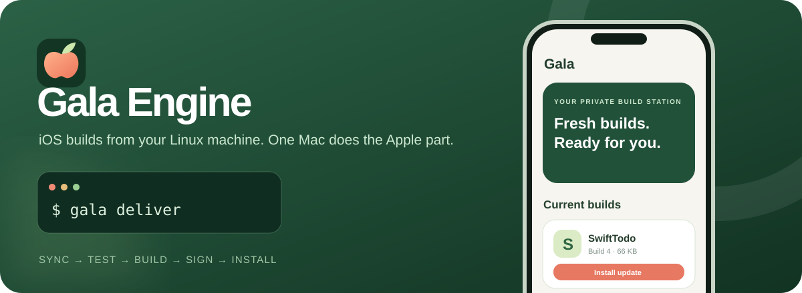
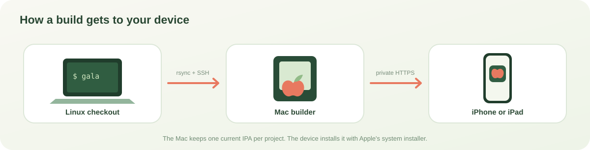

# Gala Engine



**Build iPhone and iPad apps from Linux, using your own Mac for the Apple-only steps.** One command syncs your working tree, runs your project's tests and build recipe, signs the app on the Mac, and makes the current build available on your private tailnet.

```sh
nix develop
gala deliver
```

Gala supports SwiftUI, UIKit, C++ ports, React Native, Expo, and other projects through a small `ios-build.sh` recipe. It sends incremental source changes with rsync, reuses Mac build caches, and returns the unsigned IPA, logs, and test reports to Linux.

Already have a device IPA? Run `gala push /path/to/app.ipa`. Gala signs and delivers it without syncing source, testing, or building. You can run this from any directory, with no Gala recipe.

The Mac keeps only each project's **current** signed IPA for private delivery; it does not keep a build history.

| Where you work | What Gala does | Where the app goes |
| --- | --- | --- |
| Linux laptop or agent | Syncs current files; runs `gala test`, `build`, `run`, or `deliver` | USB install from the laptop, or private OTA install on iPhone and iPad |
| Mac build worker | Runs project recipes with the iPhoneOS SDK; caches build intermediates; signs deliveries | Serves the current build through Tailscale |
| iPhone or iPad | Shows current builds in the native Gala app | Opens the iOS install handoff and shows IPA transfer progress |


*Illustrated UI preview. The native [Gala app](app/Gala/README.md) is included in this repository. The first device build awaits hands-on confirmation; the existing private web installer remains available for bootstrapping.*



**Start here:** [one-time setup](#one-time-setup) · [add a project](#add-a-project) · [test and deliver](#test-gate-and-publish) · [native app](app/Gala/README.md) · [Linux device setup](#pair-and-deploy-from-the-thinkpad)

The Mac worker listens only on `127.0.0.1`. SSH carries control calls and rsync; Tailscale Serve exposes the installer only within the tailnet. Gala builds your current working tree, including uncommitted edits. It needs no account, simulator, or GitHub push in the build path.

## One-time setup

On the Mac, install Xcode and its iPhoneOS SDK. Keep the bulk build volume mounted. On the client, make sure `ssh macbook` reaches the Mac over Tailscale. If your SSH alias has another name, use `GALA_HOST` or `--host`.

For a fresh client, add an SSH alias using the Mac's Tailscale name from `tailscale status`:

```sshconfig
Host macbook
    HostName <mac-tailnet-name>
    User <mac-user>
```

On the Mac, turn on System Settings → General → Sharing → Remote Login, with access for that user. The Mac worker needs local access to the external volume. This Mac's SSH sessions receive `Interrupted system call` on the USB volume despite Remote Login's full disk access option, so Gala Engine never writes project files there through an SSH shell. Install the worker from a local Mac session:

```sh
mkdir -p /Volumes/BlenderBuild/gala-engine
git clone https://github.com/Shlok-Bhakta/Gala-Engine.git /Volumes/BlenderBuild/gala-engine-tool
cp /Volumes/BlenderBuild/gala-engine-tool/bin/gala /Volumes/BlenderBuild/gala-engine/service.py
cp /Volumes/BlenderBuild/gala-engine-tool/mac/{dashboard.html,install.html,sw.js,manifest.webmanifest,icon.svg,icon-57.png,icon-512.png,webpush.js,package.json,package-lock.json} /Volumes/BlenderBuild/gala-engine/
cp /Volumes/BlenderBuild/gala-engine-tool/mac/apns.js /Volumes/BlenderBuild/gala-engine/
cd /Volumes/BlenderBuild/gala-engine
npm_config_cache=/Volumes/BlenderBuild/gala-engine/npm-cache npm ci --ignore-scripts --no-audit --no-fund
cp /Volumes/BlenderBuild/gala-engine-tool/mac/com.gala.engine.plist ~/Library/LaunchAgents/
launchctl bootstrap gui/$(id -u) ~/Library/LaunchAgents/com.gala.engine.plist
tailscale serve --bg --https=443 --set-path=/gala http://127.0.0.1:18732
```

The LaunchAgent starts when that user logs in after a reboot. The plist starts with console output directed to `/dev/null` because launchd cannot open a log file on this USB volume. Once Python has checked volume access, the worker redirects stdout and stderr to `service.log` on the volume. It trims that file at 20 MB; each build also writes its own log there. If `gala doctor` reports a volume access error, grant `/opt/homebrew/bin/python3` access in System Settings → Privacy & Security → Full Disk Access. The worker keeps its script, configuration, source mirrors, build caches, signed current IPAs, and push subscriptions on the USB volume. It binds rsync to `127.0.0.1:18730`, build control to `127.0.0.1:18731`, and the private install server to `127.0.0.1:18732`. Keep the Tailscale Serve route tailnet only. Do not use Funnel for `/gala`.

For Mac signing, install a valid development or ad hoc profile that includes both devices and a matching certificate with its private key in the Mac keychain. The current wildcard development profile lists two devices and the matching certificate. This Mac's signing key has the required keychain grant, and a signed SwiftTodo delivery passed the Mac and Linux HTTPS checks. On a fresh setup, if `codesign` waits for authorization, grant Apple signing tools access to this specific development key from an interactive Mac shell, including an SSH shell, without opening the laptop:

```sh
security set-key-partition-list -S apple-tool:,apple: -s -t private -l 'Apple Development: ZIYANG CHEN (ZIYANG CHEN)' ~/Library/Keychains/login.keychain-db
```

Enter the Mac login keychain password at its prompt. Do not put it in a shell argument or send it to an agent. Until that authorization succeeds, `gala deliver` cannot produce an installable OTA IPA.

Clone Gala Engine on the client and enter its Nix shell:

```sh
git clone https://github.com/Shlok-Bhakta/Gala-Engine.git ~/Projects/Gala-Engine
nix develop ~/Projects/Gala-Engine
gala doctor
```

You can also add the command to an existing shell without entering a development shell:

```sh
nix shell ~/Projects/Gala-Engine#default
```

`gala doctor` checks Xcode, the iPhoneOS SDK, the Metal compiler, free space on the Mac's internal disk and Gala's storage, the build queue, and whether the Mac worker can write to the selected build root. Xcode 26 downloads the Metal compiler separately; if doctor reports it missing, run `xcodebuild -downloadComponent MetalToolchain` on the Mac. The default Mac storage root is `/Volumes/BlenderBuild/gala-engine`. Override it with `GALA_REMOTE_ROOT` if this Mac uses another bulk volume; start the worker with the matching `--root`. Gala Engine creates its own project mirrors under that root; it never syncs into your normal Mac checkout or the Mac's internal disk.

### Run Gala on the Mac itself

The Mac worker can also be the client. When `--host` (default `macbook`) resolves to one of this Mac's own addresses, or when you pass `--host local`, Gala skips SSH and talks to the local worker and rsync daemon directly. Put the command on the Mac's `PATH` and check it:

```sh
ln -sfn /Volumes/BlenderBuild/Projects/Gala-Engine/bin/gala ~/.local/bin/gala
gala doctor   # prints "Mac worker: this machine (no SSH)"
```

Run it from a local Mac session, not over SSH, so it can read projects on the USB volume. A Mac checkout gets its own mirror, like any other client. The dashboard lists only the newest delivery for each bundle ID, and build numbers keep increasing across mirrors, so a Mac delivery updates an app that was first installed from a Linux delivery.

## Add a project

Put one file named `ios-build.sh` at the root of the project. It runs on the Mac with these variables:

| Variable | Meaning |
| --- | --- |
| `GALA_BUILD_DIR` | Persistent directory for Xcode DerivedData, CMake/Ninja output, and other incremental build data. |
| `GALA_ARTIFACT_DIR` | Fresh directory for this run. Builds write unsigned `.ipa` files here; tests may write reports here. |
| `GALA_JOBS` | Suggested parallel job count. Defaults to 2 for this Mac. |
| `GALA_PLATFORM` | `ios`. |

Gala Engine does not detect whether a project uses CMake, Xcode, React Native, or Expo. It runs `ios-build.sh` from the mirrored project root on the Mac. The script decides every build command. Put its final unsigned IPA anywhere under `GALA_ARTIFACT_DIR`; the worker finds IPAs recursively, validates them, and sends them back with a build log and manifest. If another tool writes the IPA elsewhere, copy it into that directory in the recipe. There is no separate output-path setting.

The script can call `xcodebuild`, CMake/Ninja, Expo prebuild, or other project tools. It must exit nonzero on failure and put an IPA in the artifact directory on success. Gala Engine checks the ZIP and `Payload/*.app` layout, calculates SHA-256, and returns the build log either way. Bare `gala` builds, signs, and deploys to the connected device. `gala run` does the same thing.

To get `gala` from an app's own `nix develop`, add Gala Engine to that app's flake dev shell. The [SwiftTodo flake](examples/SwiftTodo/flake.nix) is a minimal example. From its directory, the daily flow is:

```sh
nix develop
gala
```

Run the build from anywhere under the project:

```sh
gala build
```

Results arrive at `.gala/runs/<job-id>/` in the project. Add `.gala/` to the project's `.gitignore`. Before a new test, build, run, or delivery, Gala deletes the prior run directories from both the Linux checkout and its Mac mirror. A gated invocation keeps its test and build results together until the next invocation. The Mac keeps `GALA_BUILD_DIR` and the current source mirror for incremental builds; it does not keep a history of IPAs.

The Mac mirror name includes a short hash of the client hostname, checkout path, Git remote, and the project's path within that repo. Different Linux hosts and checkouts cannot overwrite each other's synced source. A lock also serializes Gala runs from the same checkout. Use `--name` only when deliberately reusing a fixed mirror; sharing a name across active clients can cause a sync collision.

## Test, gate, and publish

For Mac-side tests, add an executable `ios-test.sh` at the same root as `ios-build.sh`. It can run Swift or XCTest unit tests, JavaScript tests, linting, static checks, or custom project commands. It receives the same `GALA_*` variables as the build recipe. Write JUnit XML, coverage, and other reports under `GALA_ARTIFACT_DIR` to retrieve them. It does not need to produce an IPA.

```sh
gala test              # sync, run ios-test.sh, return test.log and reports
gala build --gate      # test must pass before building
gala run --gate        # ThinkPad: test, build, sign, and upgrade over USB
gala deliver           # test, build, Mac sign, publish the current OTA build
gala push /path/to/app.ipa  # Mac sign and deliver an existing IPA, no recipe needed
gala build --deliver   # same delivery flow from the build command
gala watch             # ThinkPad: run once, then rebuild and upgrade after edits
gala watch --action deliver  # test, build, sign, and notify after edits
gala exec -- ./tools/render.sh  # run a command in the Mac mirror and fetch $GALA_ARTIFACT_DIR
gala queue             # jobs running or waiting on the Mac
gala reports           # logs, screenshots, and crashes sent by the installed app
```

### Queue, timings, and agent output

The Mac runs one job at a time across every project and client, because it has 8 GB of RAM. Commands sync first, then join a first-in, first-out queue. While waiting, the client prints its queue position and the job ahead of it; it then streams the recipe output as it runs. A gated build or delivery runs its test and build back to back in one queue slot. Ctrl-C, or killing the client, cancels its queued or running job. If a client vanishes without cancelling, for example after an SSH drop, the Mac drops its queued job after two minutes and stops its running job after five.

Every project command ends with a one-line timing summary covering prepare, sync, queue, test, build, fetch, and publish. Pass `--json` to send all progress to stderr and print only one JSON object on stdout: `ok`, `timings`, `job`, `logs`, `artifacts`, `run_dir`, the `install_url` for deliveries, and `error` on failure. The same object is saved to `.gala/last-result.json`.

The Mac remembers the source fingerprint of the last passing `ios-test.sh` for each mirror. The client computes the fingerprint from the path, size, and modification time of every tracked or untracked, non-ignored file, and the Mac adds its current Xcode version. Dependencies outside the project are not covered. If nothing changed, the test step in `gala deliver`, `--gate`, or `--deliver` is skipped and the summary says so. An explicit `gala test` always runs. Pass `--retest` to force the test.

### Run commands on the Mac

`gala exec -- <command>` syncs the project, queues the command in the Mac mirror with the same `GALA_*` variables as the recipes, streams its output, and fetches anything written to `$GALA_ARTIFACT_DIR` into `.gala/runs/<job>/`. It exits with the command's status. Pass a single quoted string for shell syntax, such as `gala exec -- 'make preview && cp out/*.png "$GALA_ARTIFACT_DIR"'`. Add `--no-sync` to rerun against the current mirror. It replaces SSH-and-rsync loops for quick visual checks and keeps them in the build queue.

The Mac's GPU works without a display or login window. Tests can compile Metal shaders and render offscreen with Metal or Core Graphics, then write PNGs to `$GALA_ARTIFACT_DIR` for an agent to inspect. The testing-glass project's `ios-test.sh` renders every level this way.

Jobs get `TMPDIR` and `CLANG_MODULE_CACHE_PATH` on the external volume, so compiler scratch stays off the Mac's small internal disk. They also get a fixed `PATH` with Homebrew, Node 24, Bun, and `~/.local/bin`, whatever shell started the service. Recipes that call `xcodebuild` must still pass `-derivedDataPath "$GALA_BUILD_DIR/DerivedData"` and `-packageCachePath "$GALA_BUILD_DIR/SwiftPM"`, because Xcode's defaults are on the internal disk. A test that needs a simulator should create its own device and delete it on exit; simulator data also lives on the internal disk.

### Device reports

Agents cannot see the phone, so an installed app can send reports back. Copy [`examples/GalaReporter/GalaReporter.swift`](examples/GalaReporter/GalaReporter.swift) into the app and call `GalaReporter.start()` at launch. It forwards `print` and `NSLog` output, sends MetricKit crash and hang diagnostics and uncaught exceptions on the next launch, and can capture the screen with `GalaReporter.screenshot()` or `start(screenshotAfter: 3)`. Mac signing adds the private `GalaReportURL` to the delivered app's `Info.plist`, so the file needs no configuration and does nothing in builds Gala did not sign. On the build client, `gala reports` downloads the reports to `.gala/reports/` and lists them newest first. `--clear` deletes the Mac's copies. The Mac keeps the newest 50 logs, 20 crash reports, and 20 screenshots for each project.

### Mac cleanup

Each command clears that project's previous runs on both machines. The Mac also deletes leftover signing and job scratch when the service starts. Every hour it expires deliveries older than 48 hours, and it removes project mirrors, build caches, and reports that no client has used for 21 days. Build numbers for each bundle ID are kept in `build-numbers.json`, so they keep increasing after a mirror is removed. The shared compiler module cache is cleared when the Xcode version changes, and `service.log` is trimmed once it grows past 20 MB.

At startup and every hour, an idle worker shuts down simulators booted for at least 12 hours. It uses simctl's boot timestamp, or records first observation when the timestamp is unavailable. It closes Simulator.app after the last device shuts down. A running or queued Gala job, or signing in progress, prevents this cleanup. The worker also terminates build helpers owned by this user when they are older than 12 hours, orphaned under launchd, sleeping, have no live children, and consumed no CPU between housekeeping checks. Every shutdown and termination goes to `service.log`. Cleanup failures are logged and do not stop the worker.

`gala deliver` is the one-command agent path on crabcake. It requires `ios-test.sh`; a missing or failing test prevents signing and notification. On success it prints one `Delivered <app> build <n>: <install URL>` line. Notification results stay on the Mac in `apns-status.json` and `push-status.json`; the client does not report who was notified. `gala build --deliver` does the same. A recipe failure returns a nonzero CLI status and the log path. Agents should read the full log, fix the cause, and retry. A successful test step only proves what that project's test script actually checks. The SwiftTodo example currently checks iOS Swift type correctness and bundle identity; the owner separately confirmed its task UI on a physical phone.

`gala watch` polls tracked and non-ignored untracked source files, waits for edits to settle, then repeats the selected action. It keeps watching after a failed action. It ignores `.gala`, Git metadata, and common generated build directories. Use `--action build` for an unsigned artifact without a phone, or `--action deliver` to publish each successful gated build. `--gate` works with watch's `build` and `run` actions. Stop it with Ctrl-C. Watch is a plain terminal loop, not a multi-pane TUI.

`gala push /path/to/app.ipa` uploads an existing device IPA, signs it with the Mac's matching credentials, and publishes it to the private installer with the usual build alerts. `gala publish` is the same command. The IPA can come from any build tool or an agent's own build cycle. An explicit path needs no `ios-build.sh` or `ios-test.sh`, and Gala does not sync source, test, or build. The owner still taps Install on the device.

Inside a Gala project, publishing uses that project's normal identity. Elsewhere, the current directory identifies the delivery and holds `.gala/` results. Pass `--name my-app` to keep a fixed delivery name across directories or machines. Omitting the IPA path selects the latest unsigned Gala IPA and requires an `ios-build.sh` project.

```sh
gala push /path/to/app.ipa --name my-app --json  # Linux or agent client
gala push /path/to/app.ipa --host local         # local Mac session
```

Both commands print the private HTTPS install page, return the signed IPA URL in JSON output, and write `.gala/current-publish.json`. The Mac advances `CFBundleVersion` for each delivery, while keeping `CFBundleIdentifier` stable. The current signed IPA replaces the prior one for that project and expires after 48 hours. No IPA is uploaded to Planista or GitHub. The Mac needs a profile that covers the app bundle ID and both devices. A single universal IPA can update both devices when its `UIDeviceFamily` includes iPhone and iPad.

On each iPhone and iPad, connect Tailscale, open `https://<mac-tailnet-name>/gala/` in Safari, use **Add to Home Screen**, open Gala from the Home Screen, and tap **Turn On** (or the bell) to enable build alerts. Gala stores one Web Push subscription per device on the Mac's external drive. When a delivery succeeds, the Mac sends both devices a notification. Tapping it opens the private install page and attempts the `itms-services` handoff. If iOS blocks the automatic handoff, tap **Install** on that page. The Home Screen dashboard can also install directly: each build's **Install** button turns into a transfer ring. Gala shows each app's real icon, extracted from the IPA at publish time. The install page shows the IPA transfer observed by the Mac; iOS does not report its final installation progress or success back to the page. The manifest URL changes with each build and install attempt to avoid a stale cached manifest. After the icon settles, fully close and reopen the app to check its build number. Keep the same bundle ID and signing team to update the existing icon and data. This path needs no MDM or erase, but the current Mac uses a development profile; Apple's documented wireless distribution setup uses Ad Hoc distribution signing, so verify actual update behavior on the device before relying on OTA for data-preserving updates.

Gala does not run physical iOS UI automation from crabcake. Maestro's iOS flows require an Apple simulator, which this setup intentionally does not use. A pass on `gala test` and `gala build` therefore cannot claim that the app's actual screen or touch flow was verified. The current device check is a human opening the OTA build or using `gala run` from the ThinkPad and reporting behavior. Device UI automation needs a future physical-device runner with an attached iPhone or iPad.

For a real minimal UIKit example:

```sh
cd ~/Projects/Gala-Engine/examples/UIKitHello
gala build
```

The example produces an unsigned arm64 iPhone/iPad IPA without an Xcode project or simulator.

### Native build notifications

The native Gala app can receive build alerts through APNs. Sign it with an explicit `com.galaengine.app` provisioning profile that includes `aps-environment`, registered devices, and a certificate whose private key is in the Mac keychain. A wildcard profile cannot provide native push. The delivery signer rejects profiles without push when an app declares `GalaRequiresPush` in its Info.plist.

Keep the APNs provider certificate and the private key used to create its CSR under the external storage root. Convert Apple's downloaded certificate to PEM:

```sh
mkdir -p /Volumes/BlenderBuild/gala-engine/apns
chmod 700 /Volumes/BlenderBuild/gala-engine/apns
openssl x509 -inform DER -in Gala-APNs.cer -out /Volumes/BlenderBuild/gala-engine/apns/apns-cert.pem
# Put the matching CSR private key at apns/apns-key.pem.
chmod 600 /Volumes/BlenderBuild/gala-engine/apns/*.pem
```

Install `mac/apns.js` beside the worker's `service.py` and restart the worker after updating it. The sender uses Node's built-in HTTP/2 support and the same Node executable as Web Push. In the native app's Settings, tap **Enable Build Alerts**. The Mac stores tokens in `apns-subscriptions.json` with owner-only permissions and records send counts and failure reasons in `apns-status.json`. It selects sandbox or production APNs from each device's signed provisioning profile and removes rejected device tokens. Native APNs and Web Push run independently; a push failure does not roll back a successful delivery.

The 48-hour delivery lifetime also controls the native app's list. Expired deliveries are hidden immediately and their IPA, metadata, and icon are deleted by hourly cleanup. Starting another build for the same project clears its previous delivery before the new run, so a failed build or an unsigned build can leave that project absent from the list. Tests and `gala exec` keep the current delivery available. Build caches and apps already installed on devices remain. Delivering the project again adds its current build back to Gala.

## Pair and deploy from the ThinkPad

The Nix shell provides `idevicepair`, `idevicedevmodectl`, `ideviceinstaller`, `zsign`, and `lsusb`. NixOS must also run `usbmuxd`; the ThinkPad's `~/nixos-config` has device-specific USB rules for the owner's iPad and iPhone. Apply that system configuration with `nrs` before pairing. No simulator is involved.

Connect and unlock the device, then run:

```sh
nix develop ~/Projects/Gala-Engine
gala device list
gala device pair
gala device doctor
```

Accept **Trust This Computer** on the device and enter its passcode when prompted. If more than one Apple device is connected, pass `--udid` to the device commands. If Developer Mode is off, enable it on the device under Settings → Privacy & Security → Developer Mode; `idevicedevmodectl reveal` can make that menu visible. A passcode-protected device needs the final Developer Mode approval on its screen.

To sign on Linux, obtain a `.p12` containing the Apple Development certificate **and its private key**, plus a matching development `.mobileprovision` that includes the device and app bundle ID. Keep the private key outside Git. Gala Engine looks for `~/.config/gala-engine/development.p12` and `development.mobileprovision` by default. It reads `development.p12.password` from the same directory when present, or prompts for the password. Then, from the app project:

```sh
gala
```

`gala` syncs, builds, returns the IPA, signs it with `zsign`, and uses `ideviceinstaller upgrade` to update the app over USB. On a first install, it falls back to `ideviceinstaller install`. Keep the app's `CFBundleIdentifier` stable: changing it creates a separate icon and app data container. Open the app on the device after deployment. Linux's `idevicedebug` cannot launch this iOS 27 phone yet because it asks for a matching developer image. Use `gala build` and `gala deploy` separately when diagnosing a step; `deploy` accepts an IPA path. The device's first app launch may ask you to trust the developer. See the upstream [pairing](https://github.com/libimobiledevice/libimobiledevice/blob/master/docs/idevicepair.1), [Developer Mode](https://github.com/libimobiledevice/libimobiledevice/blob/master/docs/idevicedevmodectl.1), [install and upgrade](https://github.com/libimobiledevice/ideviceinstaller/blob/master/man/ideviceinstaller.1), and [signing](https://github.com/zhlynn/zsign) documentation for the underlying commands.

## Sync behavior

Normal `rsync` uses file size and modification time to decide which paths need inspection. For a changed file, it transfers differences rather than blindly copying the entire tree. A Git branch switch may update timestamps and cause some otherwise identical files to be sent again. Gala Engine has no cross-branch content store on the client or Mac. The rsync daemon runs on the Mac under the local worker's volume access; its port is available only through SSH.

Use `gala sync --dry-run` to see what would change. Use `gala build --checksum` when timestamp churn is causing excess transfer; that compares file contents on both machines, but reads the whole tree on both sides. The default is faster for ordinary edit-build cycles.

Gala Engine excludes Git metadata, `.gala`, Nix/Node/Expo/Xcode build directories, and patterns from each `.gitignore`. It deletes synced files removed from the client source mirror while preserving `GALA_BUILD_DIR`. Large dependencies already installed on the Mac can live outside the mirror and be referenced by `ios-build.sh`.

## Existing projects

- **Native SwiftUI/UIKit:** Put `xcodebuild` in `ios-build.sh`, set a stable `-derivedDataPath` inside `GALA_BUILD_DIR`, target `generic/platform=iOS`, and package the unsigned device `.app` as `Payload/App.app` in the IPA. `gala` signs the returned IPA on Linux.
- **Blender port:** Reuse the device CMake/Ninja and `package_sideload_ipa.py` commands from its current PR preview workflow. Keep the dependency prefix and revision-matched host tools on the Mac's bulk volume. Give Gala Engine's mirror a new CMake build directory because CMake caches the source path.
- **React Native:** Run its iOS release build through the generated Xcode workspace. The recipe handles JavaScript bundling, CocoaPods, the device `.app`, and IPA packaging. Keep DerivedData in `GALA_BUILD_DIR` and dependency caches on the Mac's bulk volume.
- **Expo:** Prebuild the iOS project on the Mac, then run its Xcode build in `ios-build.sh`. `eas build --local` is an alternative for EAS parity, but Expo's local mode does not support caching.

The Mac queues jobs across all Gala Engine projects and runs one at a time, which fits its 8 GB of RAM. Source sync happens before a job joins the queue.

## SourceKit language service

This Mac has `sourcekit-lsp` in Xcode, but Gala Engine does not yet proxy it to Linux editors. A useful proxy needs to keep the project mirror current, start SourceKit from the Mac worker so it can read the USB volume, and translate `file://` document paths in both directions between the Linux checkout and Mac mirror. Running `ssh macbook xcrun sourcekit-lsp` alone would hit the USB volume access failure observed here. Build output and diagnostics are available today through `gala build` and its log.

## Agent use

The shared `~/.agents/skills/gala-engine/SKILL.md` gives agents the command sequence and output rules. Project-specific build logic belongs in each project's `ios-build.sh`; this repository's [AGENTS.md](AGENTS.md) covers changes to Gala Engine itself.
