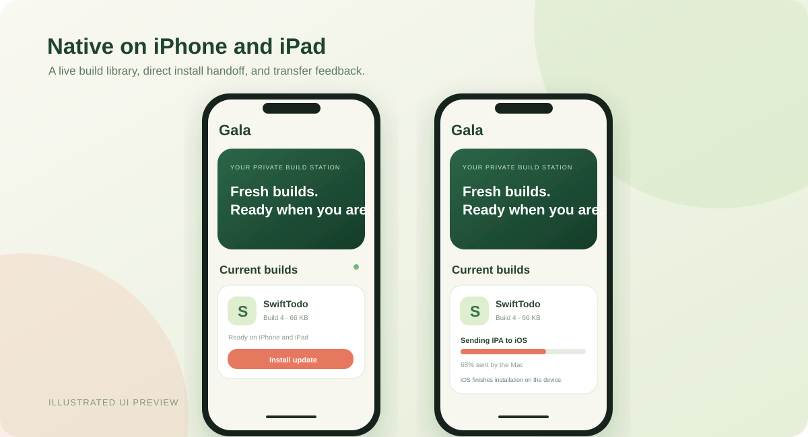

# Gala for iPhone and iPad

Gala is the native companion for a private Gala Engine build worker. It lists the current signed build for each project, starts the iOS installation handoff, and displays the IPA bytes the Mac has sent to iOS. It is written in SwiftUI for iOS and iPadOS 26 or later.



The transfer bar measures the IPA response from the Mac. iOS does not provide this app with a final installation percentage or a callback when the installed app is ready. After the icon settles, close and reopen the updated app to see the new version. The current native build has been compiled and delivered through Gala, but its on-device installation and handoff still need verification.

## Install on the owner's devices

From a Linux checkout with Gala configured, run:

```sh
cd app/Gala
gala deliver
```

This tests, builds, signs, and publishes the current IPA through the Mac. Open the returned private Tailscale install URL in Safari on the iPhone and iPad to install Gala for the first time. Tailscale must be connected on the device. The owner's current provisioning profile includes only the registered devices; other users need their own signing profile.

After installation, Gala reads the Mac's Tailscale server address embedded at build time. You can change it in **Settings → Build server**. The app shows the latest build for each project; tapping **Install update** requests a fresh one-time manifest, hands it to iOS, and follows the Mac's transfer status. If iOS rejects the direct handoff, Gala opens the existing private web installer.

## Build an unsigned IPA

Run the recipe on a Mac with the iPhoneOS SDK. Keep its work and artifact directories on a volume with enough space:

```sh
GALA_BUILD_DIR=/path/to/build-cache \
GALA_ARTIFACT_DIR=/path/to/artifacts \
GALA_DEFAULT_SERVER=none \
./ios-build.sh
```

`GALA_DEFAULT_SERVER=none` leaves the server field empty for a distributable unsigned build. With that variable omitted, the recipe embeds the Mac's Tailscale DNS name when available. An unsigned IPA needs to be signed with a profile that covers the target devices before installation.

## Notifications

This first native release links to Gala's existing Home Screen web app for build notifications. Native APNs alerts need an explicit App ID, an APNs-enabled provisioning profile, and notification registration; the current wildcard development profile cannot provide that entitlement. The web app can still notify enrolled devices when a new build is delivered. Gala does not silently install apps on a personal iPhone or iPad; iOS requires a user action for this delivery path.
